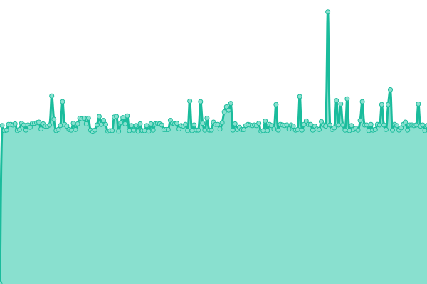
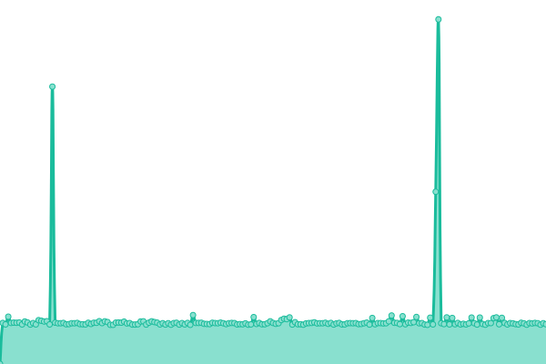
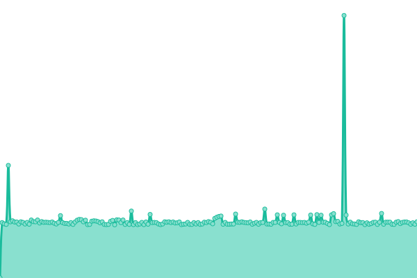
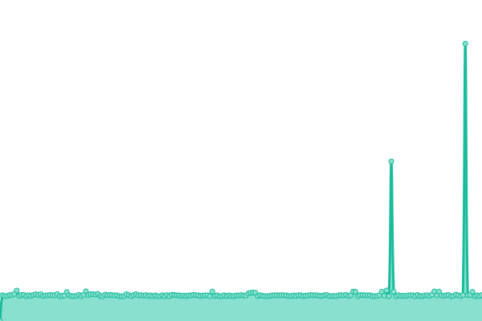

# [📈 Live Status](https://mschirrmeister.github.io/upptime-loopx): <!--live status--> **🟥 Complete outage**

This repository contains the open-source uptime monitor and status page for [Marco Schirrmeister](https://mschirrmeister.github.io/upptime-loopx), powered by [Upptime](https://github.com/upptime/upptime).

With [Upptime](https://upptime.js.org), you can get your own unlimited and free uptime monitor and status page, powered entirely by a GitHub repository. We use [Issues](https://github.com/mschirrmeister/upptime-loopx/issues) as incident reports, [Actions](https://github.com/mschirrmeister/upptime-loopx/actions) as uptime monitors, and [Pages](https://mschirrmeister.github.io/upptime-loopx) for the status page.

<!--start: status pages-->
<!-- This summary is generated by Upptime (https://github.com/upptime/upptime) -->
<!-- Do not edit this manually, your changes will be overwritten -->
<!-- prettier-ignore -->
| URL | Status | History | Response Time | Uptime |
| --- | ------ | ------- | ------------- | ------ |
|  [Do53 Roost IPv4 UDP](http://107.189.10.142:9202) | 🟥 Down | [do53-roost-i-pv4-udp.yml](https://github.com/mschirrmeister/upptime-loopx/commits/HEAD/history/do53-roost-i-pv4-udp.yml) | 

 284ms
     
 | 

<a href="https://mschirrmeister.github.io/upptime-loopx/history/do53-roost-i-pv4-udp">70.75%</a>
    

|  [Do53 Roost IPv4 TCP](http://107.189.10.142:9203) | 🟥 Down | [do53-roost-i-pv4-tcp.yml](https://github.com/mschirrmeister/upptime-loopx/commits/HEAD/history/do53-roost-i-pv4-tcp.yml) | 

 304ms
     
 | 

<a href="https://mschirrmeister.github.io/upptime-loopx/history/do53-roost-i-pv4-tcp">69.72%</a>
    

|  [Do53 Roost IPv6 UDP](http://107.189.10.142:9204) | 🟥 Down | [do53-roost-i-pv6-udp.yml](https://github.com/mschirrmeister/upptime-loopx/commits/HEAD/history/do53-roost-i-pv6-udp.yml) | 

 290ms
     
 | 

<a href="https://mschirrmeister.github.io/upptime-loopx/history/do53-roost-i-pv6-udp">71.14%</a>
    

|  [Do53 Roost IPv6 TCP](http://107.189.10.142:9205) | 🟥 Down | [do53-roost-i-pv6-tcp.yml](https://github.com/mschirrmeister/upptime-loopx/commits/HEAD/history/do53-roost-i-pv6-tcp.yml) | 

 288ms
     
 | 

<a href="https://mschirrmeister.github.io/upptime-loopx/history/do53-roost-i-pv6-tcp">69.44%</a>
    

<!--end: status pages-->

[**Visit our status website →**](https://mschirrmeister.github.io/upptime-loopx)

## 📄 License

- Powered by: [Upptime](https://github.com/upptime/upptime)
- Code: [MIT](./LICENSE) © [Anand Chowdhary](https://anandchowdhary.com), supported by [Pabio](https://pabio.com)
- Data in the `./history` directory: [Open Database License](https://opendatacommons.org/licenses/odbl/1-0/)
